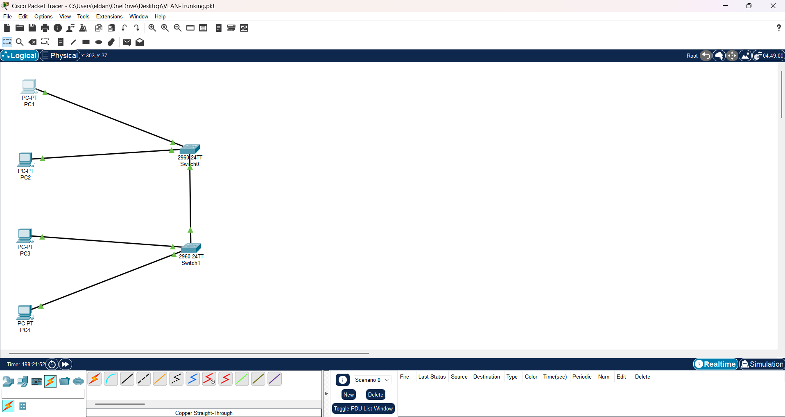
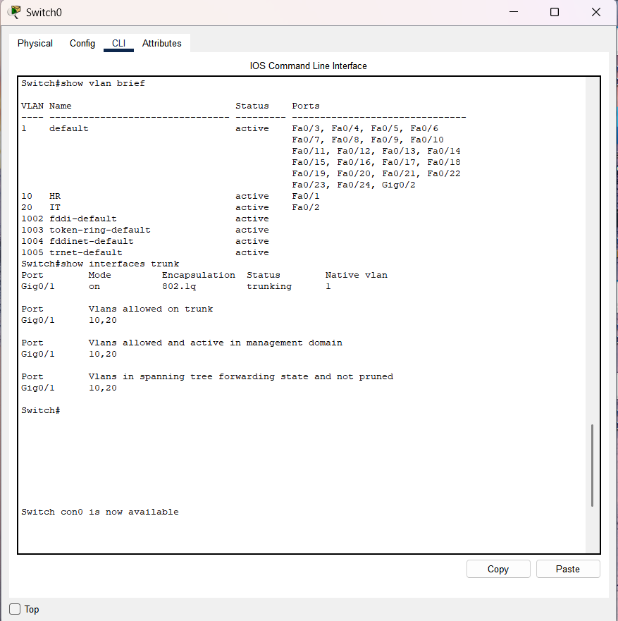
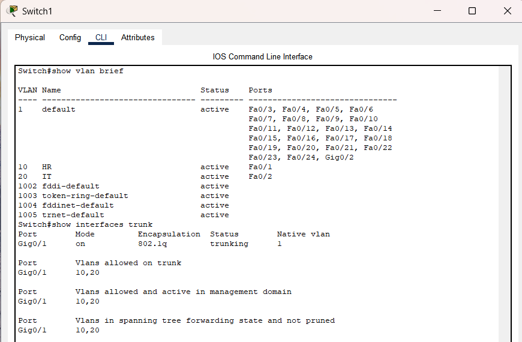

# VLAN Configuration & Trunking Lab

## Objective

Configure VLANs and trunking between two Cisco switches in Cisco Packet Tracer.

## Topology

## VLAN Design

| VLAN ID | Name |
| ------- | ---- |
| 10      | HR   |
| 20      | IT   |

## Configuration Summary

* Created VLAN 10 (HR)
* Created VLAN 20 (IT)
* Assigned switch access ports to VLANs
* Configured trunk link between switches
* Verified VLAN operation and trunk connectivity

## Configuration Details

### VLAN Creation
- Created VLAN 10 (HR)
- Created VLAN 20 (IT)

### Access Port Configuration
- Assigned PC1 and PC3 to VLAN 10
- Assigned PC2 and PC4 to VLAN 20
- Configured switchports in access mode

### Trunk Configuration
- Configured Fa0/24 between SW1 and SW2 as a trunk link
- Allowed VLANs 10 and 20 on the trunk
- Verified trunk status using `show interfaces trunk`

### Verification
- Confirmed VLAN separation using `show vlan brief`
- Verified trunk operation between switches
- Tested inter-VLAN isolation using ping tests

## Verification Screenshots

### VLAN Table & Trunk Status Switch 0

### VLAN Table & Trunk Status Switch 1

## Skills Learned

* VLAN configuration
* Trunking
* Switchport modes
* Layer 2 switching
* Network troubleshooting

## Files

- [Download Packet Tracer Lab](VLAN-Trunking.pkt)
