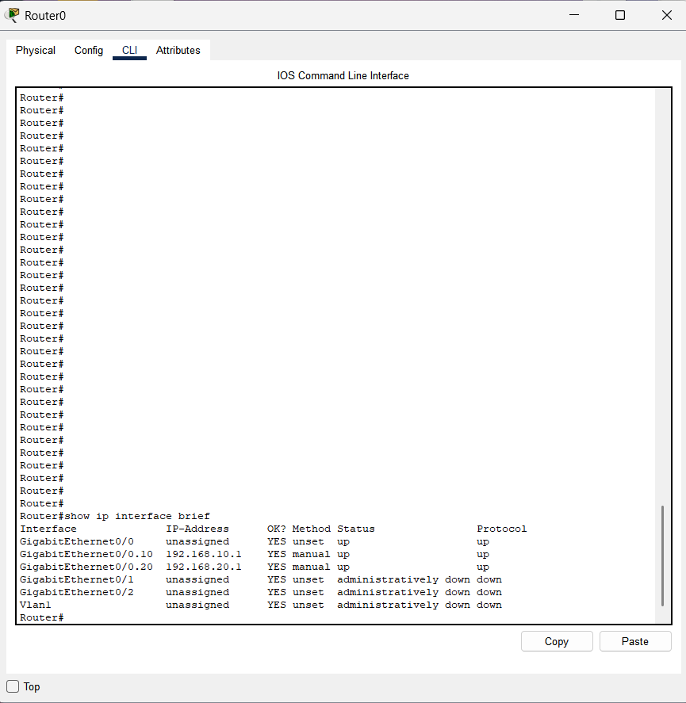
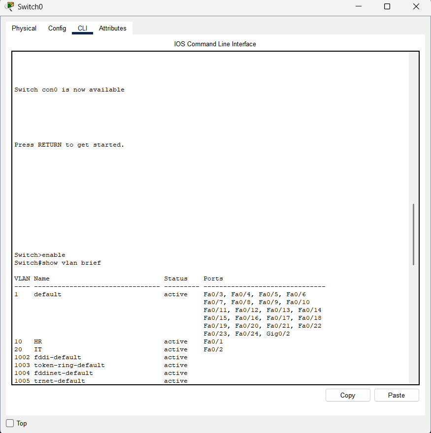
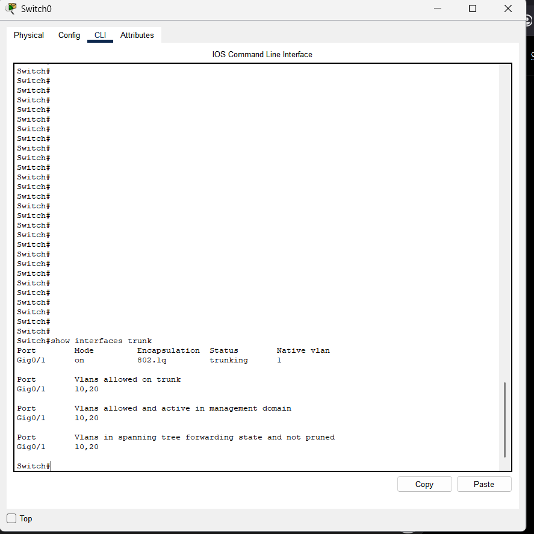

# Inter-VLAN Routing Lab

## Objective

Configure Router-on-a-Stick Inter-VLAN Routing using 802.1Q subinterfaces.

## Topology

.png)

## VLAN Design

| VLAN ID | Name | Network |
|----------|----------|----------|
| 10 | HR | 192.168.10.0/24 |
| 20 | IT | 192.168.20.0/24 |

## Configuration Summary

- Created VLAN 10 and VLAN 20
- Configured switch access ports
- Configured trunk link between switch and router
- Configured router subinterfaces using 802.1Q encapsulation
- Assigned default gateways to hosts
- Verified communication between VLANs
## Verification

### Router Interfaces

### VLAN Configuration

### Trunk Status

### Connectivity Test

PC0 (VLAN 10) successfully communicated with PC1 (VLAN 20) through Router-on-a-Stick Inter-VLAN Routing.

## Skills Learned

- Inter-VLAN Routing
- Router-on-a-Stick
- 802.1Q encapsulation
- Layer 3 forwarding
- Default gateways
- Network troubleshooting
