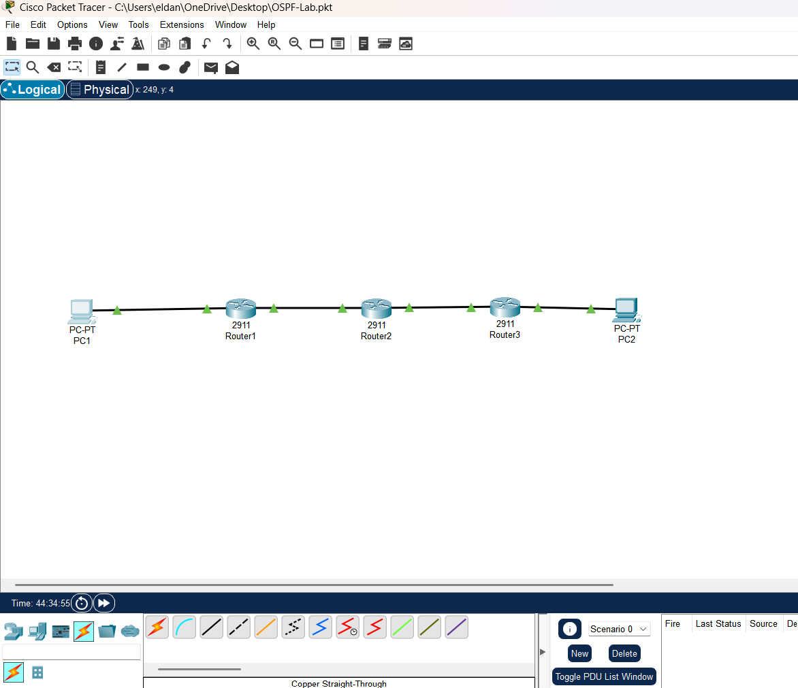
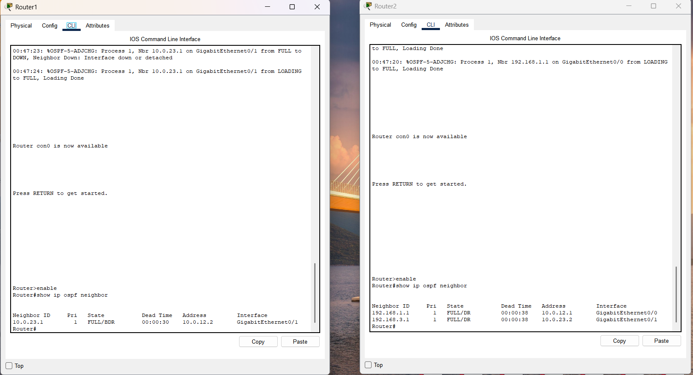
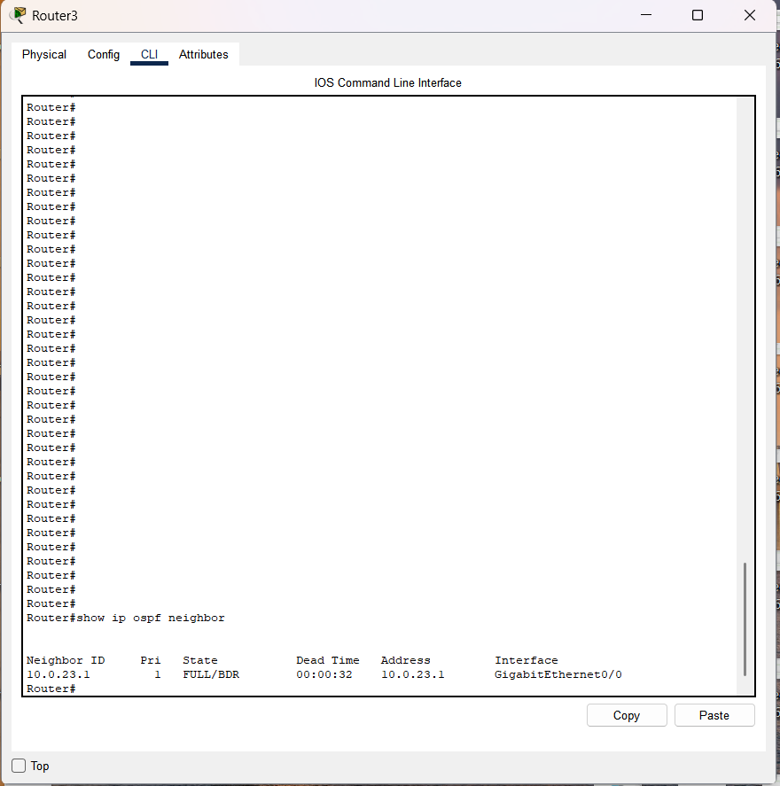
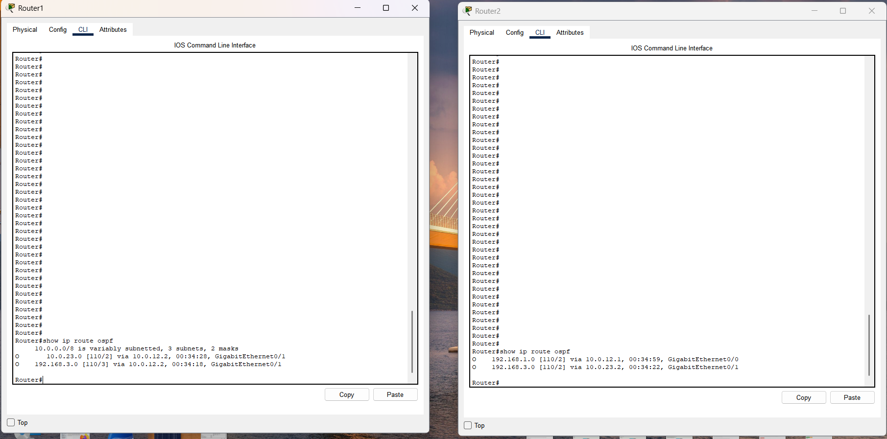
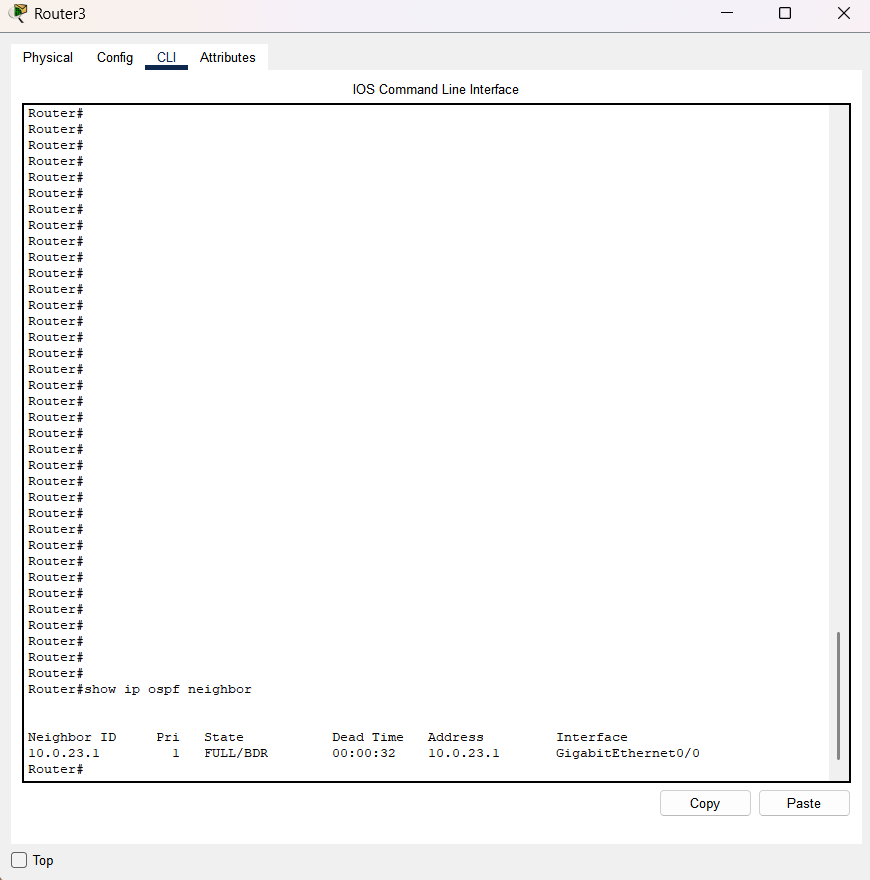
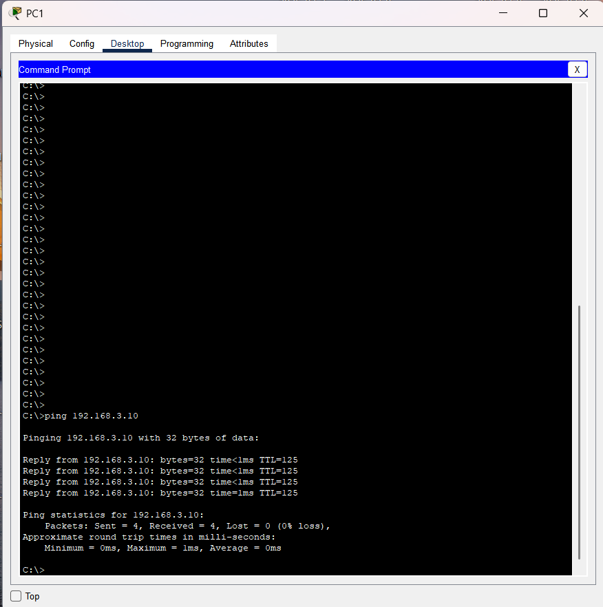

# OSPF Routing Lab

## Objective

Configure OSPF to dynamically exchange routes between multiple routers and verify end-to-end connectivity.

## Topology

## IP Addressing

| Device | Interface | IP Address |
|----------|----------|----------|
| R1 | G0/0 | 192.168.1.1/24 |
| R1 | G0/1 | 10.0.12.1/30 |
| R2 | G0/0 | 10.0.12.2/30 |
| R2 | G0/1 | 10.0.23.1/30 |
| R3 | G0/0 | 10.0.23.2/30 |
| R3 | G0/1 | 192.168.3.1/24 |
| PC1 | NIC | 192.168.1.10/24 |
| PC2 | NIC | 192.168.3.10/24 |

## Configuration Summary

- Configured IP addressing on all router interfaces
- Configured OSPF Area 0 on all routers
- Established OSPF neighbor relationships
- Learned remote routes dynamically through OSPF
- Verified end-to-end connectivity between LANs

## Verification

### OSPF Neighbor Relationships

### OSPF Routing Table

### End-to-End Connectivity

## Skills Learned

- Dynamic Routing
- OSPF
- Route Advertisement
- Neighbor Relationships
- Routing Table Verification
- Network Troubleshooting

## Files

- [Download Packet Tracer Lab](OSPF-Lab.pkt)
