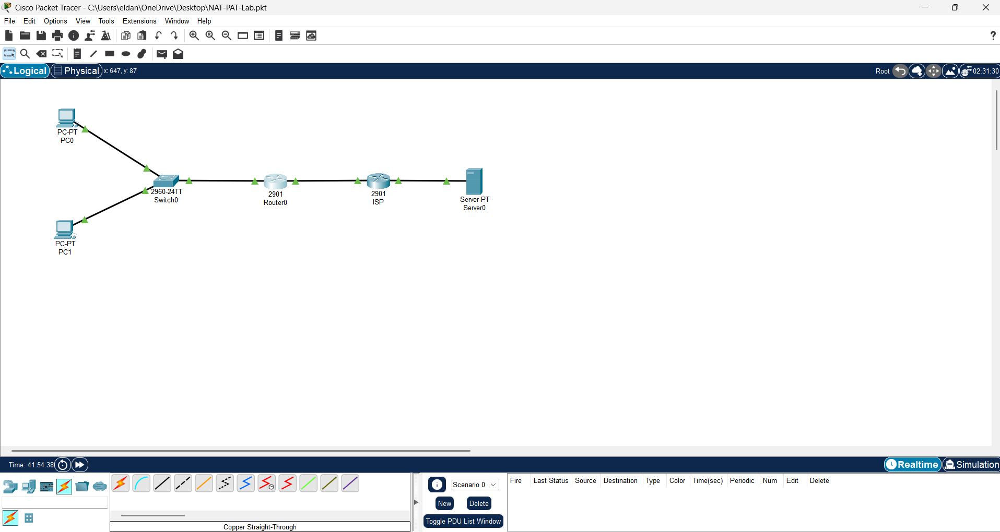
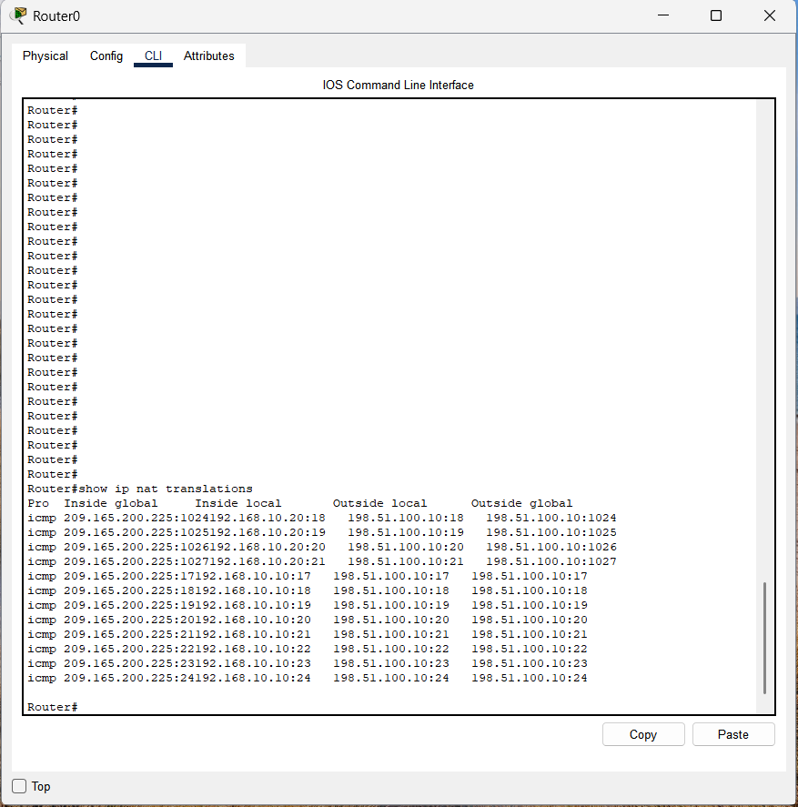
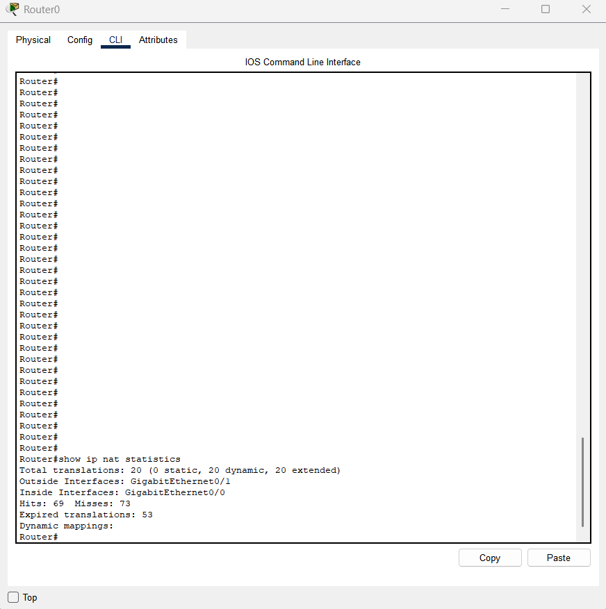
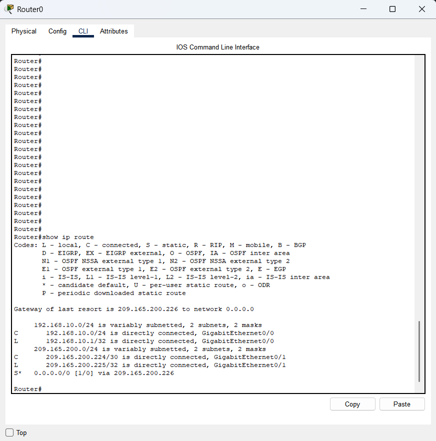
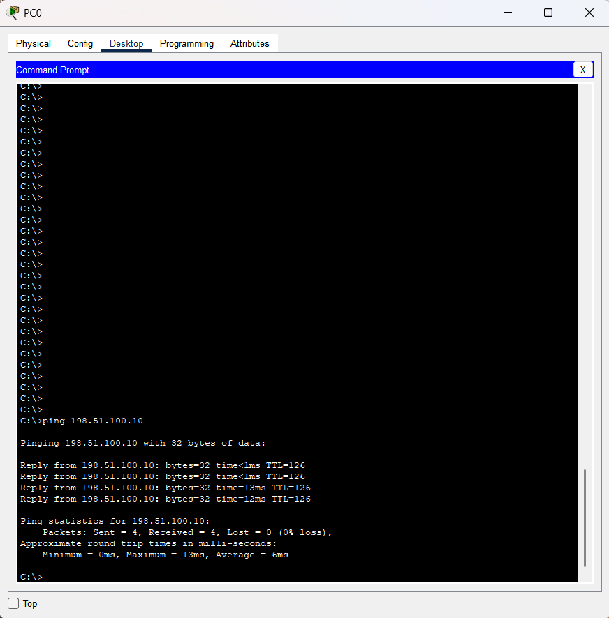
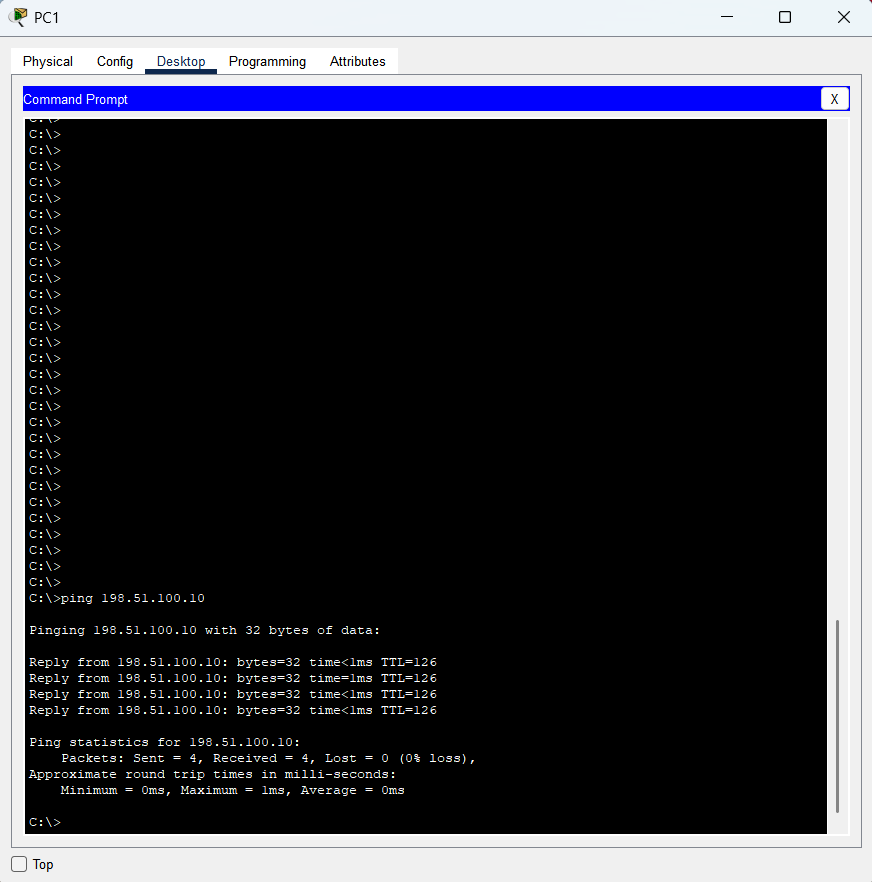

# NAT/PAT Lab

## Objective

Configure Port Address Translation (PAT) to allow multiple internal devices to share a single public IP address while communicating with an external network.

## Topology

## IP Addressing

| Device | Interface | IP Address |
|----------|----------|------------|
| PC1 | NIC | 192.168.10.10/24 |
| PC2 | NIC | 192.168.10.20/24 |
| R1 | G0/0 (Inside) | 192.168.10.1/24 |
| R1 | G0/1 (Outside) | 209.165.200.225/30 |
| ISP | G0/0 | 209.165.200.226/30 |
| ISP | G0/1 | 198.51.100.1/24 |
| Server | NIC | 198.51.100.10/24 |

## Configuration Summary

- Configured inside and outside router interfaces
- Assigned private and public IP addressing
- Created a standard ACL to identify inside local addresses
- Configured PAT using the router's outside interface
- Added a default route to reach external networks
- Verified NAT translations and end-to-end connectivity

## Verification

### NAT Translation Table

### NAT Statistics

### Routing Table

### PC1 Connectivity Test

### PC2 Connectivity Test

## Skills Learned

- Static Routing
- NAT
- Port Address Translation (PAT)
- Standard ACLs
- Inside vs. Outside Interfaces
- Network Troubleshooting

## Files

- [Download Packet Tracer Lab](NAT-PAT-Lab.pkt)
