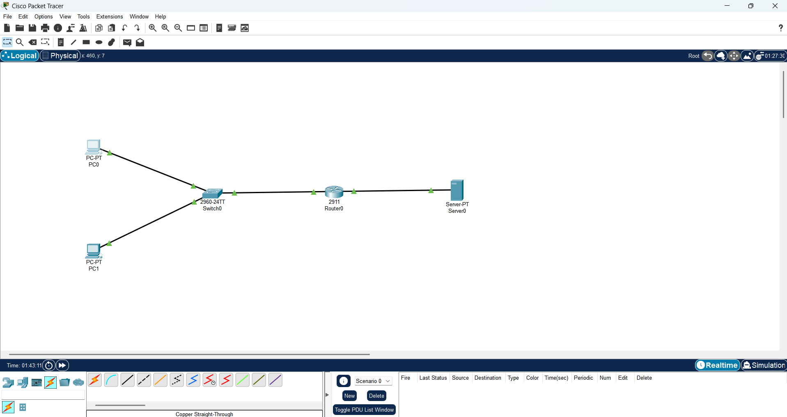
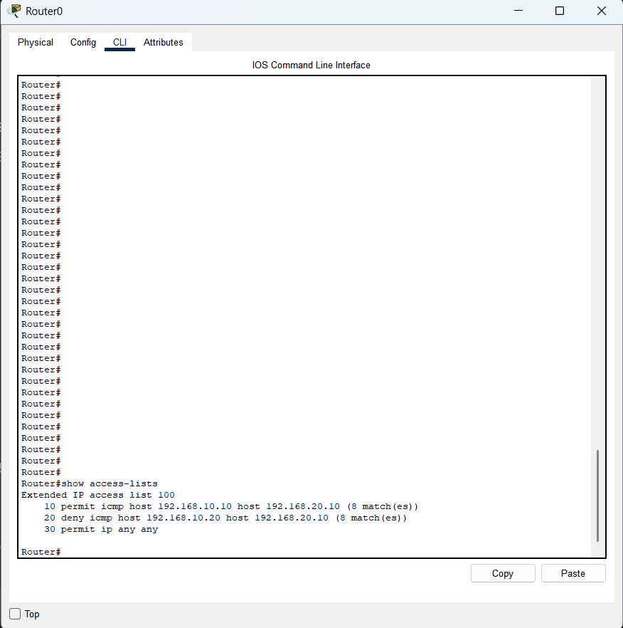
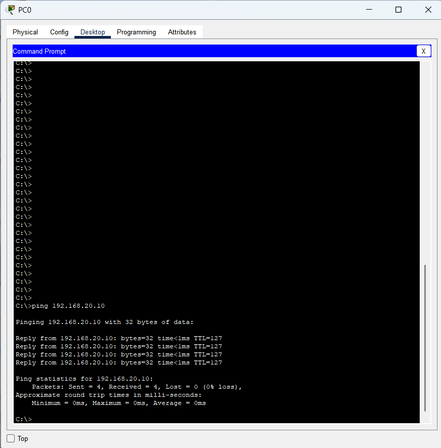
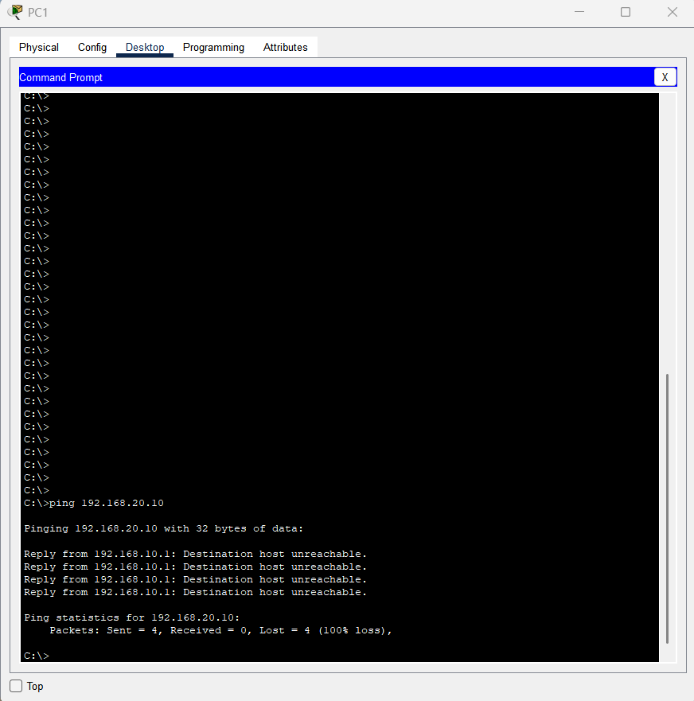

# Access Control Lists (ACL) Lab

## Objective

Configure an extended ACL to control traffic between hosts by allowing PC0 to reach the server while blocking PC1.

---

## Topology



---

## IP Addressing

| Device | Interface | IP Address |
|---------|-----------|------------|
| PC0 | NIC | 192.168.10.10/24 |
| PC1 | NIC | 192.168.10.20/24 |
| R0 | G0/0 | 192.168.10.1/24 |
| R0 | G0/1 | 192.168.20.1/24 |
| Server | NIC | 192.168.20.10/24 |

---

## ACL Configuration

```
10 permit icmp host 192.168.10.10 host 192.168.20.10
20 deny icmp host 192.168.10.20 host 192.168.20.10
30 permit ip any any
```

Applied inbound/outbound on R1 interface connected to the server network.

---

## Verification

### ACL Configuration



---

### PC0 Connectivity (Allowed)



---

### PC1 Connectivity (Blocked)



---

## Skills Learned

- Standard vs Extended ACLs
- Traffic filtering based on source and destination
- ACL sequence processing
- Router interface filtering
- Network security fundamentals

---

## Files

- [Download Packet Tracer Lab](ACL-Lab.pkt)
